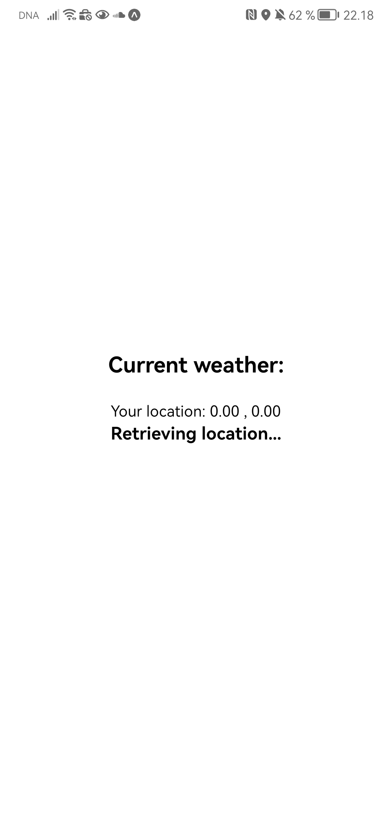
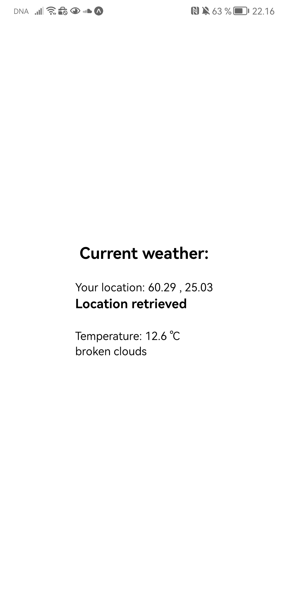

# get_weather

**Weather App**

This mobile app provides real-time weather information for your current location. It utilizes the Expo framework for React Native to retrieve weather data from an external API based on your latitude and longitude.

**Features:**
- Fetches current weather data for your location, including temperature and weather description.
- Displays the retrieved weather information.
- Allows users to view the location's latitude and longitude coordinates.

**Components:**
- **App.js**: The main component that defines the app's structure. It includes the "Position" component to fetch location data and display current weather information.

- **Position.js**: This component retrieves the user's current latitude and longitude using the Expo Location API. It then passes this information to the "Weather" component for weather data retrieval. The component also handles errors and loading states, displaying relevant messages.

- **Weather.js**: The component responsible for fetching and displaying weather information based on the provided latitude and longitude. It queries an external weather API, interprets the response, and presents the temperature, weather description, and an optional weather icon if available.

**Usage:**
To use this app, you'll need to set up your environment, including providing the required API URL and keys, as well as installing the necessary dependencies, such as the Expo framework.

**Important Note:**
Make sure to configure the app with your own weather API URL and keys for it to function properly.

**Author:**
Hannu Karjalainen with some help from ChatGPT on this readme

    
    

